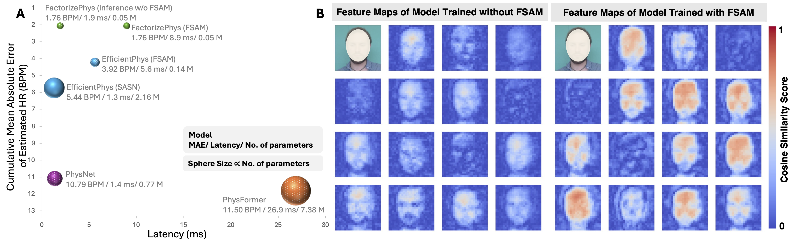

:fire: Please remember to :star: this repo if you find it useful and cite our work if you end up using it in your work! :fire:

:fire: If you have any questions or concerns, please create an <a href="https://github.com/PhysiologicAILab/FactorizePhys/issues">issue</a> :memo:! :fire:

# FactorizePhys: Matrix Factorization for Multidimensional Attention in Remote Physiological Sensing

  **Jitesh Joshi**1, **Sos S. Agaian**2 and **Youngjun Cho**1

  1 Department of Computer Science, University College London, UK

  2 Department of Computer Science, College of Staten Island, City University of New York, USA

---------------------------------

## Introduction

  This work introduces the Factorized Self-Attention Module (FSAM), which uses nonnegative matrix factorization to compute multidimensional attention across spatial, temporal, and channel dimensions collectively, rather than separately. It proposes FactorizePhys, an end-to-end 3D-CNN model leverages FSAM to estimate blood volume pulse signals from video frames. The method enhances signal extraction tasks by effectively factorizing voxel embeddings for multidimensional attention and demonstrates adaptability by integrating into EfficientPhys, an established 2D-CNN-based architecture. FSAM's effectiveness and cross-dataset generalization are validated through experiments on four datasets, surpassing state-of-the-art rPPG techniques. The study highlights FSAM's potential as a general multidimensional attention mechanism and provides insights into the role of nonnegative matrix factorization in rPPG, offering a new approach for estimating accurate physiological signals from spatial-temporal data. 

*This work is accepted at NeurIPS, 2024*

## Proposed Factorized Self-Attention Module (FSAM)
  

Please refer to our paper for notations and symbols used in this figure. 

## FactorizePhys and EfficientPhys with FSAM

## Cross-Dataset Generalization and Learned Spatial-Temporal Features

(A) Cumulative cross-dataset performance (MAE) v/s latency\* plot; (B) Visualization of learned spatial-temporal features for base 3D-CNN model trained with and without FSAM. \* System specs: Ubuntu 22.04 OS, NVIDIA GeForce RTX 3070 Laptop GPU, Intel® Core™ i7-10870H CPU @ 2.20GHz, 16 GB RAM

# About the Repository

## :notebook: Algorithms

The repo currently supports the following algorithms:

* Traditional Unsupervised Algorithms
  * [Remote plethysmographic imaging using ambient light (GREEN)](https://pdfs.semanticscholar.org/7cb4/46d61a72f76e774b696515c55c92c7aa32b6.pdf?_gl=1*1q7hzyz*_ga*NTEzMzk5OTY3LjE2ODYxMDg1MjE.*_ga_H7P4ZT52H5*MTY4NjEwODUyMC4xLjAuMTY4NjEwODUyMS41OS4wLjA), by Verkruysse *et al.*, 2008
  * [Advancements in noncontact multiparameter physiological measurements using a webcam (ICA)](https://affect.media.mit.edu/pdfs/11.Poh-etal-TBME.pdf), by Poh *et al.*, 2011
  * [Robust pulse rate from chrominance-based rppg (CHROM)](https://ieeexplore.ieee.org/document/6523142), by Haan *et al.*, 2013
  * [Local group invariance for heart rate estimation from face videos in the wild (LGI)](https://openaccess.thecvf.com/content_cvpr_2018_workshops/papers/w27/Pilz_Local_Group_Invariance_CVPR_2018_paper.pdf), by Pilz *et al.*, 2018
  * [Improved motion robustness of remote-PPG by using the blood volume pulse signature (PBV)](https://iopscience.iop.org/article/10.1088/0967-3334/35/9/1913), by Haan *et al.*, 2014
  * [Algorithmic principles of remote ppg (POS)](https://ieeexplore.ieee.org/document/7565547), by Wang *et al.*, 2016
  * [Face2PPG: An Unsupervised Pipeline for Blood Volume Pulse Extraction From Faces (OMIT)](https://ieeexplore.ieee.org/document/10227326), by Álvarez *et al.*, 2023

* Supervised Neural Algorithms
  * **FactorizePhys with FSAM - proposed 3D-CNN architecture**
  * [Remote Photoplethysmograph Signal Measurement from Facial Videos Using Spatio-Temporal Networks (PhysNet)](https://bmvc2019.org/wp-content/uploads/papers/0186-paper.pdf), by Yu *et al.*, 2019
  * [EfficientPhys: Enabling Simple, Fast and Accurate Camera-Based Cardiac Measurement (EfficientPhys)](https://openaccess.thecvf.com/content/WACV2023/papers/Liu_EfficientPhys_Enabling_Simple_Fast_and_Accurate_Camera-Based_Cardiac_Measurement_WACV_2023_paper.pdf), by Liu *et al.*, 2023
  * **EfficientPhys with our proposed FSAM** (adapted for TSM network):
  * [PhysFormer: Facial Video-based Physiological Measurement with Temporal Difference Transformer (PhysFormer)](https://openaccess.thecvf.com/content/CVPR2022/papers/Yu_PhysFormer_Facial_Video-Based_Physiological_Measurement_With_Temporal_Difference_Transformer_CVPR_2022_paper.pdf), by Yu *et al.*, 2022

## :file_folder: Datasets

The repo supports four datasets, namely iBVP, PURE, SCAMPS, and UBFC-rPPG. **To use these datasets in a deep learning model, you should organize the files as follows.**

  * [iBVP](https://github.com/PhysiologicAILab/iBVP-Dataset)
    * Joshi, J.; Cho, Y. iBVP Dataset: RGB-Thermal rPPG Dataset with High Resolution Signal Quality Labels. Electronics 2024, 13, 1334.
    -----------------
          iBVP_Dataset/
          |   |-- p01_a/
          |      |-- p01_a_rgb/
          |      |-- p01_a_t/
          |      |-- p01_a_bvp.csv
          |   |-- p01_b/
          |      |-- p01_b_rgb/
          |      |-- p01_b_t/
          |      |-- p01_b_bvp.csv
          |...
          |   |-- pii_x/
          |      |-- pii_x_rgb/
          |      |-- pii_x_t/
          |      |-- pii_x_bvp.csv
    -----------------

  * [PURE](https://www.tu-ilmenau.de/universitaet/fakultaeten/fakultaet-informatik-und-automatisierung/profil/institute-und-fachgebiete/institut-fuer-technische-informatik-und-ingenieurinformatik/fachgebiet-neuroinformatik-und-kognitive-robotik/data-sets-code/pulse-rate-detection-dataset-pure)
    * Stricker, R., Müller, S., Gross, H.-M.Non-contact "Video-based Pulse Rate Measurement on a Mobile Service Robot" in: Proc. 23st IEEE Int. Symposium on Robot and Human Interactive Communication (Ro-Man 2014), Edinburgh, Scotland, UK, pp. 1056 - 1062, IEEE 2014
    -----------------
         data/PURE/
         |   |-- 01-01/
         |      |-- 01-01/
         |      |-- 01-01.json
         |   |-- 01-02/
         |      |-- 01-02/
         |      |-- 01-02.json
         |...
         |   |-- ii-jj/
         |      |-- ii-jj/
         |      |-- ii-jj.json
    -----------------

  * [SCAMPS](https://arxiv.org/abs/2206.04197)
    * D. McDuff, M. Wander, X. Liu, B. Hill, J. Hernandez, J. Lester, T. Baltrusaitis, "SCAMPS: Synthetics for Camera Measurement of Physiological Signals", NeurIPS, 2022
    -----------------
         data/SCAMPS/Train/
            |-- P00001.mat
            |-- P00002.mat
         |...
         data/SCAMPS/Val/
            |-- P00001.mat
            |-- P00002.mat
         |...
         data/SCAMPS/Test/
            |-- P00001.mat
            |-- P00002.mat
         |...
    -----------------

  * [UBFC-rPPG](https://sites.google.com/view/ybenezeth/ubfcrppg)
    * S. Bobbia, R. Macwan, Y. Benezeth, A. Mansouri, J. Dubois, "Unsupervised skin tissue segmentation for remote photoplethysmography", Pattern Recognition Letters, 2017.
    -----------------
         data/UBFC-rPPG/
         |   |-- subject1/
         |       |-- vid.avi
         |       |-- ground_truth.txt
         |   |-- subject2/
         |       |-- vid.avi
         |       |-- ground_truth.txt
         |...
         |   |-- subjectn/
         |       |-- vid.avi
         |       |-- ground_truth.txt
    -----------------

## :wrench: Setup

STEP 1: `bash setup.sh`

STEP 2: `conda activate fsam`

STEP 3: `pip install -r requirements.txt`

## :computer: Example of Using Pre-trained Models

Please use config files under `./configs/infer_configs`

For example, if you want to run The model trained on PURE and tested on UBFC-rPPG, use `python main.py --config_file configs/infer_configs/PURE_UBFC-rPPG_FactorizePhys_FSAM_Res.yaml`

## :computer: Examples of Neural Network Training

Please use config files under `./configs/train_configs`

### Training on PURE and Testing on iBVP With FactorizePhys

STEP 1: Download the PURE raw data by asking the [paper authors](https://www.tu-ilmenau.de/universitaet/fakultaeten/fakultaet-informatik-und-automatisierung/profil/institute-und-fachgebiete/institut-fuer-technische-informatik-und-ingenieurinformatik/fachgebiet-neuroinformatik-und-kognitive-robotik/data-sets-code/pulse-rate-detection-dataset-pure).

STEP 2: Download the iBVP raw data by asking the [paper authors](https://github.com/PhysiologicAILab/iBVP-Dataset).

STEP 3: Modify `configs/train_configs/PURE_iBVP_FactorizePhys_FSAM_Res.yaml`

STEP 4: Run `python main.py --config_file configs/train_configs/PURE_iBVP_FactorizePhys_FSAM_Res.yaml`

Note 1: Preprocessing requires only once; thus turn it off on the yaml file when you train the network after the first time.

Note 2: The example yaml setting will allow 100% of PURE to train and and test on iBVP after training 10 for epochs. Alternatively, this can be changed to train using 80% of PURE, validate with 20% of PURE and use the best model(with the least validation loss) to test on iBVP.

### Detailed Cross-Dataset Generalization for Reproducibility

**Performance Evaluation on iBVP Dataset, for Models Trained with PURE Dataset:**

|         Model        | Attention Module |MAE (HR) ↓|RMSE (HR) ↓|MAPE (HR)↓ |Corr (HR)↑|SNR (BVP)↑ |MACC(BVP)↑|
|:--------------------:|:----------------:|:--------:|:---------:|:---------:|:--------:|:---------:|---------:|
| PhysNet              | -                | **1.63** |    3.77   |  **2.17** |   0.92   |    6.08   |   0.55   |
| PhysFormer           | TD-MHSA*         |   2.50   |    7.09   |    3.39   |   0.79   |    5.21   |   0.52   |
| EfficientPhys        | SASN             |   3.80   |   14.82   |    5.15   |   0.56   |    2.93   |   0.45   |
| EfficientPhys        | FSAM (Ours)      |   2.10   |    4.00   |    2.94   |   0.91   |    4.19   |   0.49   |
| FactorizePhys (Ours) | FSAM (Ours)      |   1.66   |  **3.55** |    2.31   | **0.93** |  **6.78** | **0.58** |
|                      |                  |          |           |           |          |           |          |

**Performance Evaluation on iBVP Dataset, for Models Trained with SCAMPS Dataset:**

|         Model        | Attention Module |MAE (HR) ↓|RMSE (HR) ↓|MAPE (HR)↓ |Corr (HR)↑|SNR (BVP)↑ |MACC(BVP)↑|
|:--------------------:|:----------------:|:--------:|:---------:|:---------:|:--------:|:---------:|---------:|
| PhysNet              | -                |   31.85  |   37.40   |   45.62   |   -0.10  |   -6.11   |   0.16   |
| PhysFormer           | TD-MHSA*         |   41.73  |   43.89   |   58.56   |   0.15   |   -9.13   |   0.14   |
| EfficientPhys        | SASN             |   26.19  |   44.55   |   38.11   |   -0.12  |   -2.36   |   0.30   |
| EfficientPhys        | FSAM (Ours)      |   13.40  |   22.10   |   19.93   |   0.05   |   -3.46   |   0.24   |
| FactorizePhys (Ours) | FSAM (Ours)      | **2.71** |  **6.22** |  **3.87** | **0.81** |  **2.36** | **0.43** |
|                      |                  |          |           |           |          |           |          |

**Performance Evaluation on iBVP Dataset, for Models Trained with UBFC-rPPG Dataset:**

|         Model        | Attention Module |MAE (HR) ↓|RMSE (HR) ↓|MAPE (HR)↓ |Corr (HR)↑|SNR (BVP)↑ |MACC(BVP)↑|
|:--------------------:|:----------------:|:--------:|:---------:|:---------:|:--------:|:---------:|---------:|
| PhysNet              | -                |   3.18   |    7.65   |    4.84   |   0.70   |    5.54   | **0.56** |
| PhysFormer           | TD-MHSA*         |   7.86   |   17.13   |   11.44   |   0.38   |    1.71   |   0.43   |
| EfficientPhys        | SASN             |   2.74   |    7.07   |    4.02   |   0.74   |    4.03   |   0.49   |
| EfficientPhys        | FSAM (Ours)      |   2.56   |    6.13   |    3.71   |   0.79   |    4.65   |   0.50   |
| FactorizePhys (Ours) | FSAM (Ours)      | **1.74** |  **4.39** |  **2.42** | **0.90** |  **6.59** | **0.56** |
|                      |                  |          |           |           |          |           |          |

**Performance Evaluation on PURE Dataset, for Models Trained with iBVP Dataset:**

|         Model        | Attention Module |MAE (HR) ↓|RMSE (HR) ↓|MAPE (HR)↓ |Corr (HR)↑|SNR (BVP)↑ |MACC(BVP)↑|
|:--------------------:|:----------------:|:--------:|:---------:|:---------:|:--------:|:---------:|---------:|
| PhysNet              | -                |   7.78   |   19.12   |    8.94   |   0.59   |    9.90   |   0.70   |
| PhysFormer           | TD-MHSA*         |   6.58   |   16.55   |    6.93   |   0.76   |    9.75   |   0.71   |
| EfficientPhys        | SASN             |   0.56   |    1.40   |    0.87   | **1.00** |   11.96   |   0.73   |
| EfficientPhys        | FSAM (Ours)      | **0.44** |  **1.19** |  **0.64** | **1.00** |   12.64   |   0.75   |
| FactorizePhys (Ours) | FSAM (Ours)      |   0.60   |    1.70   |    0.87   | **1.00** | **15.19** | **0.77** |
|                      |                  |          |           |           |          |           |          |

**Performance Evaluation on PURE Dataset, for Models Trained with SCAMPS Dataset:**

|         Model        | Attention Module |MAE (HR) ↓|RMSE (HR) ↓|MAPE (HR)↓ |Corr (HR)↑|SNR (BVP)↑ |MACC(BVP)↑|
|:--------------------:|:----------------:|:--------:|:---------:|:---------:|:--------:|:---------:|---------:|
| PhysNet              | -                |   26.74  |   36.19   |   46.73   |   0.45   |   -2.21   |   0.31   |
| PhysFormer           | TD-MHSA*         |   16.64  |   28.13   |   30.58   |   0.51   |    0.84   |   0.42   |
| EfficientPhys        | SASN             |   6.21   |   18.45   |   12.16   |   0.74   |    4.39   |   0.51   |
| EfficientPhys        | FSAM (Ours)      |   8.03   |   19.09   |   15.12   |   0.73   |    3.81   |   0.48   |
| FactorizePhys (Ours) | FSAM (Ours)      | **5.43** | **15.80** | **11.10** | **0.80** | **11.40** | **0.67** |
|                      |                  |          |           |           |          |           |          |

**Performance Evaluation on PURE Dataset, for Models Trained with UBFC-rPPG Dataset:**

|         Model        | Attention Module |MAE (HR) ↓|RMSE (HR) ↓|MAPE (HR)↓ |Corr (HR)↑|SNR (BVP)↑ |MACC(BVP)↑|
|:--------------------:|:----------------:|:--------:|:---------:|:---------:|:--------:|:---------:|---------:|
| PhysNet              | -                |   10.38  |   21.14   |   20.91   |   0.66   |   11.01   |   0.72   |
| PhysFormer           | TD-MHSA*         |   8.90   |   18.77   |   17.68   |   0.71   |    8.73   |   0.66   |
| EfficientPhys        | SASN             |   4.71   |   14.52   |    7.63   |   0.80   |    8.77   |   0.66   |
| EfficientPhys        | FSAM (Ours)      |   3.69   |   13.27   |    5.85   |   0.83   |    9.65   |   0.68   |
| FactorizePhys (Ours) | FSAM (Ours)      | **0.48** |  **1.39** |  **0.72** | **1.00** | **14.16** | **0.78** |
|                      |                  |          |           |           |          |           |          |

**Performance Evaluation on UBFC-rPPG Dataset, for Models Trained with iBVP Dataset:**

|         Model        | Attention Module |MAE (HR) ↓|RMSE (HR) ↓|MAPE (HR)↓ |Corr (HR)↑|SNR (BVP)↑ |MACC(BVP)↑|
|:--------------------:|:----------------:|:--------:|:---------:|:---------:|:--------:|:---------:|---------:|
| PhysNet              | -                |   3.09   |   10.72   |    2.83   |   0.81   |    7.13   |   0.81   |
| PhysFormer           | TD-MHSA*         |   9.88   |   19.59   |    8.72   |   0.44   |    2.80   |   0.70   |
| EfficientPhys        | SASN             |   1.14   |    2.85   |    1.42   | **0.99** |    8.71   |   0.84   |
| EfficientPhys        | FSAM (Ours)      |   1.17   |    2.87   |    1.31   | **0.99** |    8.54   |   0.85   |
| FactorizePhys (Ours) | FSAM (Ours)      | **1.04** |  **2.40** |  **1.23** | **0.99** |  **8.84** | **0.86** |
|                      |                  |          |           |           |          |           |          |

**Performance Evaluation on UBFC-rPPG Dataset, for Models Trained with PURE Dataset:**
|         Model        | Attention Module |MAE (HR) ↓|RMSE (HR) ↓|MAPE (HR)↓ |Corr (HR)↑|SNR (BVP)↑ |MACC(BVP)↑|
|:--------------------:|:----------------:|:--------:|:---------:|:---------:|:--------:|:---------:|---------:|
| PhysNet              | -                |   1.23   |    2.65   |    1.42   | **0.99** |    8.34   |   0.85   |
| PhysFormer           | TD-MHSA*         | **1.01** |  **2.40** |  **1.21** | **0.99** |    8.42   |   0.85   |
| EfficientPhys        | SASN             |   1.41   |    3.16   |    1.68   |   0.98   |    6.87   |   0.79   |
| EfficientPhys        | FSAM (Ours)      |   1.20   |    2.92   |    1.50   | **0.99** |    7.37   |   0.79   |
| FactorizePhys (Ours) | FSAM (Ours)      |   1.04   |    2.44   |    1.23   | **0.99** |  **8.88** | **0.87** |
|                      |                  |          |           |           |          |           |          |

**Performance Evaluation on UBFC-rPPG Dataset, for Models Trained with SCAMPS Dataset:**
|         Model        | Attention Module |MAE (HR) ↓|RMSE (HR) ↓|MAPE (HR)↓ |Corr (HR)↑|SNR (BVP)↑ |MACC(BVP)↑|
|:--------------------:|:----------------:|:--------:|:---------:|:---------:|:--------:|:---------:|---------:|
| PhysNet              | -                |   11.24  |   18.81   |   13.55   |   0.38   |   -0.09   |   0.48   |
| PhysFormer           | TD-MHSA*         |   8.42   |   17.73   |   11.27   |   0.49   |    2.29   |   0.61   |
| EfficientPhys        | SASN             |   2.18   |    4.82   |    2.35   |   0.96   |    4.40   |   0.67   |
| EfficientPhys        | FSAM (Ours)      |   2.69   |    5.20   |    3.16   |   0.95   |    3.74   |   0.63   |
| FactorizePhys (Ours) | FSAM (Ours)      | **1.17** |  **2.56** |  **1.35** | **0.99** |  **8.41** | **0.82** |
|                      |                  |          |           |           |          |           |          |

# Acknowledgement

We would like to express sincere thanks to the authors of [rPPG-Toolbox, Liu *et al.*, 2023](https://proceedings.neurips.cc/paper_files/paper/2023/hash/d7d0d548a6317407e02230f15ce75817-Abstract-Datasets_and_Benchmarks.html), building upon which, we developed this repo. For detailed usage related instructions, please refer the GitHub repo of the [rPPG-Toolbox](https://github.com/ubicomplab/rPPG-Toolbox).
